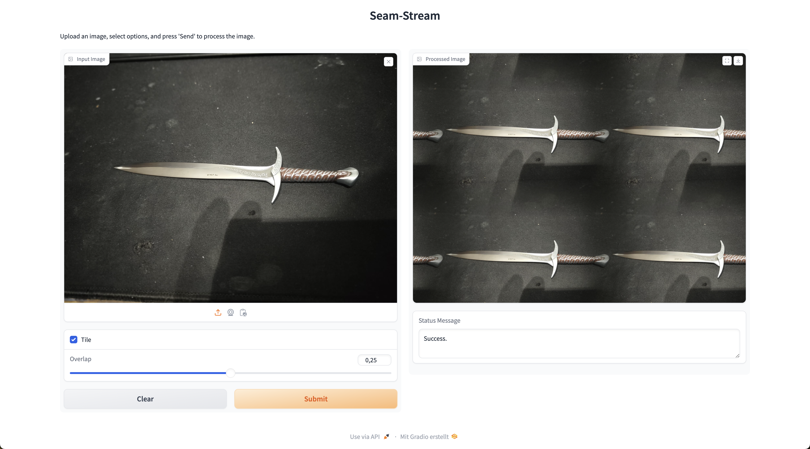

# seam-stream

seam-stream is a tool that enables users to create textures out of images using a Gradio frontend. This project provides an intuitive interface for seamless texture generation from various image inputs.



## Features

- Upload and process images to create seamless textures
- User-friendly Gradio interface for easy interaction
- Real-time preview of generated textures
- Customizable parameters for texture generation

## Installation

To set up seam-stream, follow these steps:

1. Clone the repository:
   ```
   git clone https://github.com/Maxiboy441/seam-stream.git
   cd seam-stream
   ```

2. Install the required dependencies:
   ```
   pip install -r requirements.txt
   ```


   > [!NOTE]
   > The docker setup will come soon but has issues currently for a unknown reason.

## Usage

To run seam-stream:

1. Start the Gradio application:
   ```
   python app.py
   ```

2. Open your web browser and navigate to the provided local URL (usually `http://localhost:7860`).

3. Upload an image and adjust the parameters as needed.

4. Click the "Generate Texture" button to create your seamless texture.

## Contributing

Contributions to seam-stream are welcome! Please feel free to submit a Pull Request.

## License

This project is licensed under the MIT License - see the [LICENSE](LICENSE) file for details.

## Acknowledgements

- [Gradio](https://www.gradio.app/) for the frontend framework